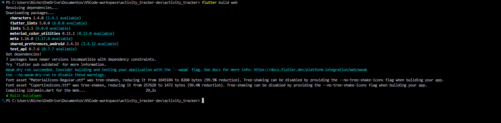
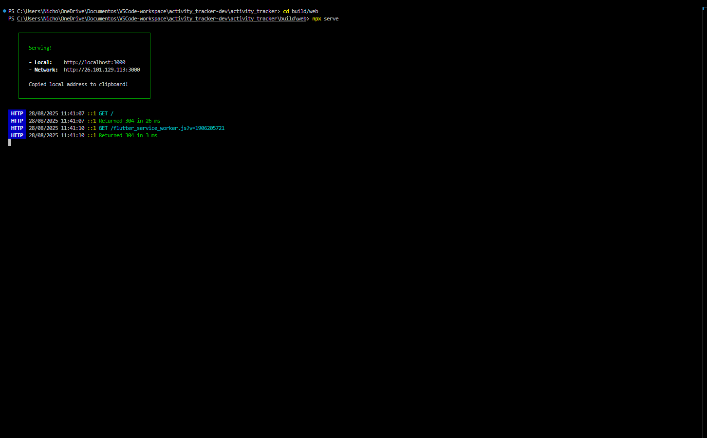

#  Activity Tracker

O Activity Tracker é uma aplicação feita em flutter que funciona como lista de tarefas (to-do list), com o objetivo de otimizar a produtividade de seus usuários, permitindo-lhes saber o que fazer, como fazer e quando fazer suas tarefas.

**Feito por:** 
- [Nicholas](https://github.com/taldoNicholas)
- - [Linkedin](https://www.linkedin.com/in/nicholashcrangel/)

---

##  Tecnologias Utilizadas

- Figma (prototipação/mock-up) - https://www.figma.com/design/3ZAh8TxBbedKVK5qGJIKCb/Activity-Tracker---mockup?node-id=0-1&t=kCSYAZCnW10qyb8Z-1 ;
- Flutter (compilado para web).

---

##  Como rodar o projeto:

Para rodar o projeto, primeiro compilei o projeto flutter para web utilizando o comando *flutter build web*:

Após compilar o projeto, através do comando *npx serve* (um comando que roda o pacote serve escrito em Node.js, permitindo executar pacotes NPM sem instalar-os globalmente), rodei a aplicação em web em um servidor local:

Segue exemplo de execução de aplicação abaixo:

---

##  Funcionalidades:

- Criação de tarefas com título e descrição;
- Validação de campos em título e descrição (não permitir inserir vazio);
- Navegação de telas entre botões superiores;
- Exibição de lista de tarefas criadas;
- Opções de definir como concluídas (*check = concluída; uncheck = em progresso*);
- Opção de excluir tarefas;
- Funcionalidade extra: lista de tarefas populada através de api externa, com leitura de status de concluída (*chave: completed , valor booleano: true ou false*);
- Persistência de dados na aplicação através do uso de sharedPreferences;
- Responsividade no design para execução WEB em aparelhos desktop e portáteis.

---

## O que aprendi:

Durante o desenvolvimento do projeto, aprendi:

- Noções básicas de desenvolvimento com a linguagem de programação *Dart* da Google (Durante o desenvolvimento com a linguagem *dart*, consegui aprimorar meus conceitos de linguagem de programação orientada à objeto);
- Noções báscias de design com framework UI *Flutter* da Google (Durante o desenvolvimento, consegui aprimorar conceitos de design front-end, além de adquirir conceitos de responsividade nativa com *Flutter* e design baseado/semelhante à interfaces *Android*);
- Boas práticas de versionamento de código (Durante o desenvolvimento da aplicação, consegui aprimorar minhas habilidades de versionamento de código com o *git-BASH*.

